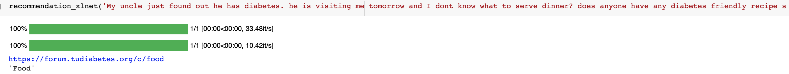
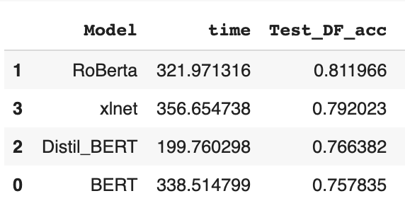
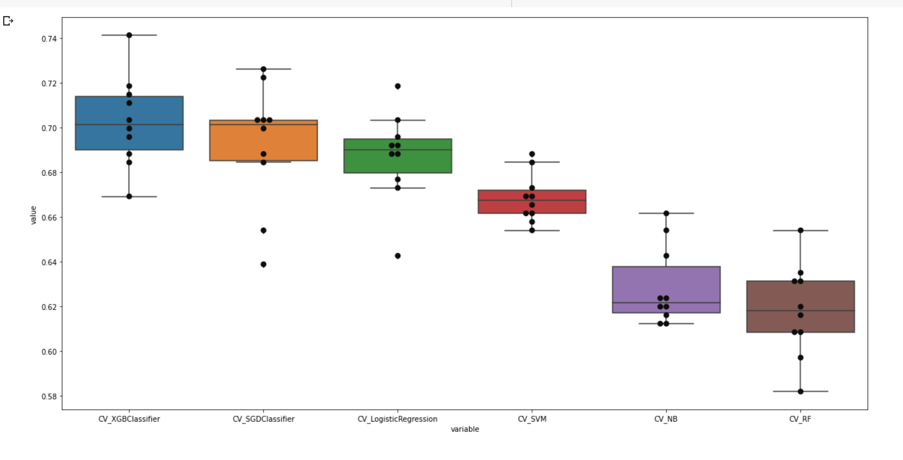

# NLP_Forum_Recommendation_Engine

** Help Diabetes Users to navigate through the  <a href="https://forum.tudiabetes.org/"> TuDiabetes</a></b> forums.**  

For some Unsuspected reason my .ipynb files cannot be displayed in my repo so please click on:

Recomendation_Engine :  https://github.com/YasaminAbbaszadegan/level1_post_recommender_20/blob/md3/Yasamin_Abbaszadegan/Yasamin_Abbaszadegan_Recomendation_Engine_Module3.ipynb

Basic_Classification_model: https://github.com/YasaminAbbaszadegan/level1_post_recommender_20/blob/md3/Yasamin_Abbaszadegan/Yasamin_Abbaszadegan__Basic_Classification_model_Module3%20.ipynb

BERT_Classification_model:
https://github.com/mentorchains/level1_post_recommender_20/blob/md4/Yasamin_Abbaszadegan/Yasamin_Abbaszadegan_Basic_BERT_Text_classification_Module4.ipynb
