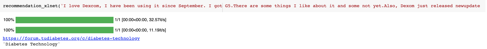

# NLP_Forum_Recommendation_Engine

 <b>** Help Diabetes Users to navigate through the  <a href="https://forum.tudiabetes.org/categories"> TuDiabetes</a></b> forums.**  

## Dataset

 <b> Scraped the forum using BeautifulSoup and Scrapy with a beakpoint of 5,000 for each category including:   
1. Social Clubs
2. Type 1 and LADA
3. Type2
4. Diabetes and Pregnancy
5. Food
6. Treatment
7. Diabetes Technology

## Model

1. <a href="https://github.com/YasaminAbbaszadegan/NLP_Forum_Recomendation_Engine/blob/master/Classification:Recomendation%20Models/Basic_Classification_Models.ipynb"> Basic Classification Models including --> LR,SVM, RF, XGB, SGB with cross validation </a>
2. <a href="https://github.com/YasaminAbbaszadegan/NLP_Forum_Recomendation_Engine/blob/master/Classification:Recomendation%20Models/Recomendation_Engine-.ipynb"> Recommendor System using Cosine Similariy </a>
3.   <a href="https://github.com/YasaminAbbaszadegan/NLP_Forum_Recomendation_Engine/blob/master/Classification:Recomendation%20Models/Basic_BERT_Text_classification.ipynb"> Transformer Classificaiton Models including: BERT, RoBERT, DistilBERT, Xlnet </a>

For some Unsuspected reason my .ipynb files cannot be displayed in my repo so please click on:

Recomendation_Engine :  https://github.com/YasaminAbbaszadegan/level1_post_recommender_20/blob/md3/Yasamin_Abbaszadegan/Yasamin_Abbaszadegan_Recomendation_Engine_Module3.ipynb

Basic_Classification_model: https://github.com/YasaminAbbaszadegan/level1_post_recommender_20/blob/md3/Yasamin_Abbaszadegan/Yasamin_Abbaszadegan__Basic_Classification_model_Module3%20.ipynb

BERT_Classification_model:
https://github.com/mentorchains/level1_post_recommender_20/blob/md4/Yasamin_Abbaszadegan/Yasamin_Abbaszadegan_Basic_BERT_Text_classification_Module4.ipynb
